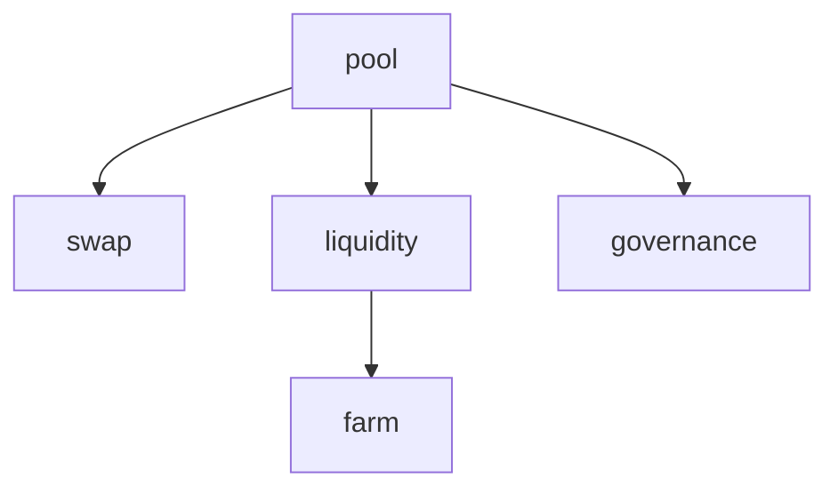

# SUI Architect - Complete Examples

Real-world walkthroughs of the architecture planning process.

## Example 1: NFT Marketplace - Complete Q&A Walkthrough

### Initial Conversation

```
🏗️  Welcome to SUI Architect!

Let's understand your project.

Question 1: What type of project are you building?
  A) DeFi (AMM, Lending, Staking, Derivatives)
  B) NFT (Marketplace, Gaming, Collectibles)
  C) GameFi (On-chain game logic, Asset management)
  D) DAO (Governance, Treasury, Voting)
  E) Infrastructure (Oracle, Bridge, Identity)
  F) Custom (Mixed or innovative type)

User: B

✅ NFT project selected

Question 2: More specifically, what's the focus?
  A) NFT Marketplace (buy/sell/auction)
  B) NFT Collection/Minting (generative art, PFPs)
  C) Gaming NFTs (in-game assets, characters)
  D) Utility NFTs (tickets, memberships, certificates)
  E) Dynamic NFTs (evolving metadata)

User: A

✅ NFT Marketplace selected

I'll provide a starting architecture template.

Standard modules for NFT Marketplace:
  - marketplace (core trading logic)
  - nft (NFT standard implementation)
  - listing (listing management)
  - offer (offer/bid system)
  - royalty (royalty distribution)
  - utils (shared utilities)

Does this structure work for you?
  A) This looks good, continue
  B) I want to add modules (e.g., auction)
  C) I want to remove modules
  D) Start from scratch

User: B - I want to add auction module

✅ Adding auction module

Updated modules:
  - marketplace
  - nft
  - listing
  - auction ← Added
  - offer
  - royalty
  - utils

Now let's dive into the details.

Question 3: User Roles
What user roles does your marketplace have?
  A) Just buyers and sellers
  B) Buyers, sellers, and admins
  C) Buyers, sellers, admins, and creators (with royalties)
  D) Custom roles

User: C

✅ Roles: Buyers, sellers, admins, creators with royalties

Question 4: NFT Standards
Which NFT standard will you use?
  A) SUI Kiosk (recommended for marketplaces)
  B) Custom NFT implementation
  C) Both (Kiosk + custom extensions)

User: A

✅ Using SUI Kiosk

[Querying latest Kiosk documentation...]
✅ Retrieved: Kiosk v1.2.0 transfer policy patterns

Question 5: Payment Methods
How should users pay for NFTs?
  A) SUI only
  B) SUI + specific tokens (e.g., stablecoins)
  C) Any token (flexible payment)

User: B

Question 6: Which stablecoins?
  [] USDC
  [] USDT
  [] DAI

User: [✓] USDC, [✓] USDT

✅ Payment: SUI, USDC, USDT

Question 7: Listing Types
What types of listings do you want?
  [] Fixed price
  [] Auction (English auction)
  [] Dutch auction (declining price)
  [] Offers/Bids

User: [✓] Fixed price, [✓] Auction, [✓] Offers

Question 8: Royalties
How should creator royalties work?
  A) Fixed percentage (e.g., 5%)
  B) Configurable per collection
  C) No royalties

User: B

✅ Configurable royalties per collection

Question 9: Storage
Where will NFT metadata be stored?
  A) On-chain (expensive but permanent)
  B) Walrus (decentralized storage)
  C) IPFS
  D) Centralized storage

User: B

✅ Will integrate Walrus for metadata storage

[Querying Walrus integration patterns...]
✅ Retrieved: Walrus SDK v0.5.0 examples

Question 10: Upgradeability
Should the contract be upgradeable?
  A) Immutable (cannot upgrade)
  B) Upgradeable with admin control
  C) Upgradeable with DAO governance

User: B

✅ Upgradeable with admin control

Question 11: Emergency Controls
Do you need emergency pause functionality?
  A) Yes, admin can pause all trading
  B) Yes, but only specific modules
  C) No pause mechanism

User: A

✅ Admin can pause all trading

Question 12: Authentication
How should users authenticate?
  A) Standard wallet (Sui Wallet, Suiet)
  B) zkLogin (Google/Facebook OAuth)
  C) Passkey (WebAuthn)
  D) Multiple options

User: D - Multiple options

Question 13: Which auth methods?
  [] Standard wallet
  [] zkLogin
  [] Passkey

User: [✓] All three

✅ Will support: Wallet, zkLogin, Passkey

[Querying zkLogin integration...]
✅ Retrieved: zkLogin v2.0.0 OAuth flow

Great! I have all the information needed.

━━━━━━━━━━━━━━━━━━━━━━━━━━━━━━━━━━

Based on your requirements, I recommend integrating:

✅ sui-kiosk
  Why: Standard NFT trading protocol
  Usage: NFT listing, transfer policies, royalties

✅ sui-walrus
  Why: Decentralized metadata storage
  Usage: Store NFT images, metadata JSON

✅ sui-zklogin
  Why: Simplified user onboarding
  Usage: Google/Facebook login

✅ sui-passkey
  Why: Passwordless authentication
  Usage: WebAuthn biometric login

━━━━━━━━━━━━━━━━━━━━━━━━━━━━━━━━━━

Let me present the architecture design in sections.
After each section, I'll check if it looks good.

━━━━━━━━━━━━━━━━━━━━━━━━━━━━━━━━━━

SECTION 1: System Overview

Your NFT Marketplace will be a decentralized platform where users can:
- List NFTs for sale (fixed price or auction)
- Make offers on NFTs
- Buy NFTs with SUI, USDC, or USDT
- Earn creator royalties on secondary sales

Key Features:
- Built on SUI Kiosk standard
- Metadata stored on Walrus
- Multiple auth methods (Wallet/zkLogin/Passkey)
- Configurable royalties per collection
- Admin controls with emergency pause

Target Users:
- Creators: Mint and list NFT collections
- Buyers: Browse and purchase NFTs
- Sellers: List owned NFTs for resale
- Admins: Manage platform

Tech Stack:
- SUI Move smart contracts
- SUI Kiosk v1.2.0
- Walrus v0.5.0 for storage
- zkLogin v2.0.0 + Passkey
- TypeScript SDK for frontend

Does this overview match your vision?

User: Yes

✅ Proceeding to module architecture...

[Continue through all 12 sections with user validation]

━━━━━━━━━━━━━━━━━━━━━━━━━━━━━━━━━━

✅ Architecture design complete!

Now I'll generate the comprehensive specification document.
```

---

## Example 2: DeFi AMM - Generated Specification (Abbreviated)

```markdown
# DeFi AMM - Project Specification

**Generated:** 2024-01-28
**Version:** 1.0.0
**SUI Framework:** v1.18.0

## Executive Summary

A decentralized Automated Market Maker (AMM) built on SUI blockchain, enabling users to swap tokens, provide liquidity, and earn trading fees.

**Key Metrics:**
- Target Launch: Q2 2024
- Initial Pairs: 10+ token pairs
- Expected TVL: $10M+ in first month
- Estimated Daily Volume: $500K+

## 1. Architecture Overview

### 1.1 System Components

```
┌─────────────────────────────────────────────┐
│         Frontend (React + TS SDK)           │
└──────────────┬──────────────────────────────┘
               │
┌──────────────▼──────────────────────────────┐
│         SUI Move Smart Contracts            │
├─────────────────────────────────────────────┤
│  pool │ swap │ liquidity │ farm │ governance│
└──────────────┬──────────────────────────────┘
               │
┌──────────────▼──────────────────────────────┐
│        SUI Ecosystem Integration            │
├─────────────────────────────────────────────┤
│  DeepBook  │  Oracle (optional)             │
└─────────────────────────────────────────────┘
```

### 1.2 Module Dependencies



## 2. Module Design

### 2.1 Pool Module

**Purpose:** Manage liquidity pools and constant product formula (x * y = k)

**Key Functions:**
- `create_pool<TokenA, TokenB>(fee_bps)`
- `get_reserves<TokenA, TokenB>(pool)`
- `calculate_output_amount(input, reserve_in, reserve_out)`

**Data Structures:**
```move
public struct Pool<phantom TokenA, phantom TokenB> has key {
    id: UID,
    reserve_a: Balance<TokenA>,
    reserve_b: Balance<TokenB>,
    lp_supply: u64,
    fee_bps: u64,  // 30 = 0.3%
    admin_cap: ID
}
```

### 2.2 Swap Module

**Purpose:** Execute token swaps using AMM formula

**Key Functions:**
- `swap_a_to_b<TokenA, TokenB>(pool, input_a) → output_b`
- `swap_b_to_a<TokenA, TokenB>(pool, input_b) → output_a`

**Formula:**
```
output = (input * 997 * reserve_out) / (reserve_in * 1000 + input * 997)
```
(0.3% fee applied)

### 2.3 Liquidity Module

**Purpose:** Add/remove liquidity and manage LP tokens

**Key Functions:**
- `add_liquidity<TokenA, TokenB>(pool, amount_a, amount_b) → LP tokens`
- `remove_liquidity<TokenA, TokenB>(pool, lp_tokens) → (amount_a, amount_b)`

### 2.4 Farm Module

**Purpose:** Liquidity mining and reward distribution

**Key Functions:**
- `stake_lp_tokens(farm, lp_tokens)`
- `claim_rewards(farm) → reward_tokens`
- `unstake_lp_tokens(farm, amount) → lp_tokens`

### 2.5 Governance Module

**Purpose:** Protocol parameter management via DAO

**Key Functions:**
- `propose_fee_change(new_fee_bps)`
- `vote_on_proposal(proposal_id, support: bool)`
- `execute_proposal(proposal_id)`

## 3. Security Considerations

### 3.1 Slippage Protection

```move
public fun swap_with_slippage(
    pool: &mut Pool<A, B>,
    input: Coin<A>,
    min_output: u64,  // Minimum acceptable output
    ctx: &mut TxContext
): Coin<B> {
    let output = swap_a_to_b(pool, input, ctx);
    assert!(coin::value(&output) >= min_output, ESlippageTooHigh);
    output
}
```

### 3.2 Reentrancy Protection

- SUI's object model prevents reentrancy
- All state changes atomic within transaction

### 3.3 Integer Overflow Protection

```move
// Use checked arithmetic
let product = (reserve_a as u128) * (reserve_b as u128);
assert!(product <= MAX_U128, EOverflow);
```

### 3.4 Flash Loan Protection

- Verify pool state at end of transaction
- Ensure k value maintained or increased

## 4. Testing Strategy

### 4.1 Unit Tests

```move
#[test]
fun test_swap_calculation() {
    let reserve_in = 1000000;  // 1M
    let reserve_out = 2000000; // 2M
    let input = 1000;

    let output = calculate_output(input, reserve_in, reserve_out);
    assert!(output == 1994, 0);  // ~0.3% fee
}
```

### 4.2 Integration Tests

- Test swap → liquidity flow
- Test farm staking → reward claiming
- Test governance proposals

### 4.3 Property-Based Tests

- Invariant: k value never decreases (unless fees extracted)
- Invariant: Total LP supply = sum of all LP balances

## 5. Deployment Plan

### 5.1 Devnet (Week 1-2)
- Deploy core pool + swap
- Internal testing

### 5.2 Testnet (Week 3-4)
- Full feature deployment
- Public bug bounty
- Liquidity incentives

### 5.3 Mainnet (Week 5)
- Audited contracts
- Initial liquidity pairs:
  - SUI/USDC
  - SUI/USDT
  - USDC/USDT

## 6. Gas Optimization

### 6.1 Batch Swaps

Allow multiple swaps in single transaction:
```move
public fun multi_swap(
    swaps: vector<SwapParams>
): vector<Coin> {
    // Process all swaps atomically
}
```

### 6.2 Minimize Storage

Store only essential data in Pool object:
- Reserves
- LP supply
- Fee rate

Store metadata separately.

## Appendix A: Formula Derivation

**Constant Product Formula:**
```
x * y = k (constant)

When swapping dx for dy:
(x + dx) * (y - dy) = k
```

Solving for dy:
```
dy = (dx * y) / (x + dx)
```

With 0.3% fee:
```
dy = (dx * 997 * y) / (x * 1000 + dx * 997)
```

## Appendix B: Reference Materials

- SUI DeepBook Integration: [Query result from sui-docs-query]
- Uniswap V2 Math: [GitHub reference]
- AMM Best Practices: [Community examples]

**Last Updated:** 2024-01-28 from sui-docs-query
```

---

## Example 3: GameFi Project - Architecture Sections

### System Overview Section

```markdown
## System Overview

A play-to-earn RPG game built on SUI blockchain where players:
- Create and upgrade character NFTs
- Battle monsters and complete quests
- Earn rewards (tokens + items)
- Trade items on in-game marketplace

Key Features:
- Character progression (levels, stats, equipment)
- Dynamic NFTs (metadata updates on-chain)
- Inventory management system
- PvE combat mechanics
- Marketplace for item trading
- Reward token economics

Target Users:
- Players: Play, earn, trade
- Game Masters: Manage game state
- Creators: Design new items/quests

Tech Stack:
- SUI Move (game logic)
- Walrus (asset storage)
- Kiosk (item marketplace)
- zkLogin (easy onboarding)
```

### Data Structures Section

```markdown
## Core Data Structures

### Character NFT

```move
public struct Character has key, store {
    id: UID,
    name: String,
    class: u8,  // 0=Warrior, 1=Mage, 2=Ranger
    level: u64,
    experience: u64,

    // Stats
    health: u64,
    max_health: u64,
    attack: u64,
    defense: u64,
    speed: u64,

    // Equipment (item IDs)
    weapon: Option<ID>,
    armor: Option<ID>,
    accessory: Option<ID>,

    // Metadata
    created_at: u64,
    last_battle: u64
}
```

### Item NFT

```move
public struct Item has key, store {
    id: UID,
    item_type: u8,  // 0=Weapon, 1=Armor, 2=Consumable
    rarity: u8,     // 0=Common, 1=Rare, 2=Epic, 3=Legendary

    // Stats (equipment only)
    attack_bonus: u64,
    defense_bonus: u64,

    // Consumable (potions, etc.)
    effect_type: Option<u8>,
    effect_value: Option<u64>,

    // Trade
    tradeable: bool
}
```

### Inventory

```move
public struct Inventory has key {
    id: UID,
    owner: address,
    items: Table<u64, Item>,  // slot → item
    capacity: u64,
    next_slot: u64
}
```

### Quest

```move
public struct Quest has key, store {
    id: UID,
    title: String,
    description: String,

    // Requirements
    min_level: u64,
    required_class: Option<u8>,

    // Rewards
    experience_reward: u64,
    token_reward: u64,
    item_rewards: vector<ID>,

    // State
    active: bool,
    completions: u64
}
```
```

### Battle System Section

```markdown
## Battle Mechanics

### Combat Formula

```move
public fun calculate_damage(
    attacker: &Character,
    defender: &Character,
    weapon: Option<&Item>
): u64 {
    let base_attack = attacker.attack;

    // Add weapon bonus
    let weapon_bonus = if (option::is_some(&weapon)) {
        let w = option::borrow(&weapon);
        w.attack_bonus
    } else {
        0
    };

    let total_attack = base_attack + weapon_bonus;
    let defense = defender.defense;

    // Damage = Attack - Defense (min 1)
    let damage = if (total_attack > defense) {
        total_attack - defense
    } else {
        1
    };

    // Apply randomness (±20%)
    apply_randomness(damage, 20)
}
```

### Battle Flow

1. Player initiates battle with monster
2. Calculate player damage → monster
3. Calculate monster damage → player
4. Repeat until one reaches 0 HP
5. If player wins:
   - Award experience
   - Award loot
   - Update character state
6. If player loses:
   - Respawn with penalty
```

---

## Example 4: DAO Governance - Complete Workflow

### Proposal Creation

```move
public fun create_proposal(
    dao: &mut DAO,
    proposer_cap: &ProposerCap,
    title: String,
    description: String,
    action: ProposalAction,
    ctx: &mut TxContext
): ID {
    // Verify proposer has enough tokens
    assert!(dao.member_tokens(tx_context::sender(ctx)) >= dao.proposal_threshold, EInsufficientTokens);

    let proposal = Proposal {
        id: object::new(ctx),
        proposer: tx_context::sender(ctx),
        title,
        description,
        action,
        votes_for: 0,
        votes_against: 0,
        status: 0,  // Active
        start_time: tx_context::epoch(ctx),
        end_time: tx_context::epoch(ctx) + dao.voting_period,
        execution_time: 0
    };

    let proposal_id = object::id(&proposal);

    // Add to DAO
    table::add(&mut dao.proposals, proposal_id, proposal);

    // Emit event
    event::emit(ProposalCreated {
        proposal_id,
        proposer: tx_context::sender(ctx),
        title
    });

    proposal_id
}
```

### Voting Mechanism

```move
public fun vote(
    dao: &mut DAO,
    proposal_id: ID,
    support: bool,
    ctx: &mut TxContext
) {
    let proposal = table::borrow_mut(&mut dao.proposals, proposal_id);

    // Verify proposal is active
    assert!(proposal.status == 0, EProposalNotActive);
    assert!(tx_context::epoch(ctx) <= proposal.end_time, EVotingEnded);

    // Get voter's token balance
    let voter = tx_context::sender(ctx);
    let voting_power = dao.member_tokens(voter);

    // Record vote
    if (support) {
        proposal.votes_for = proposal.votes_for + voting_power;
    } else {
        proposal.votes_against = proposal.votes_against + voting_power;
    };

    // Track voter (prevent double voting)
    table::add(&mut proposal.voters, voter, support);
}
```

### Proposal Execution

```move
public fun execute_proposal(
    dao: &mut DAO,
    proposal_id: ID,
    executor_cap: &ExecutorCap,
    ctx: &mut TxContext
) {
    let proposal = table::borrow_mut(&mut dao.proposals, proposal_id);

    // Verify voting ended
    assert!(tx_context::epoch(ctx) > proposal.end_time, EVotingNotEnded);

    // Check if passed (simple majority + quorum)
    let total_votes = proposal.votes_for + proposal.votes_against;
    let quorum = (dao.total_supply * dao.quorum_bps) / 10000;

    assert!(total_votes >= quorum, EQuorumNotReached);
    assert!(proposal.votes_for > proposal.votes_against, EProposalRejected);

    // Execute action
    match (proposal.action) {
        ProposalAction::UpdateParameter { param, value } => {
            update_parameter(dao, param, value);
        },
        ProposalAction::TransferFunds { recipient, amount } => {
            transfer_from_treasury(dao, recipient, amount, ctx);
        },
        // ... other actions
    };

    proposal.status = 1;  // Executed
    proposal.execution_time = tx_context::epoch(ctx);
}
```

---

These examples demonstrate the complete architecture planning process from initial Q&A to final specification documents.
