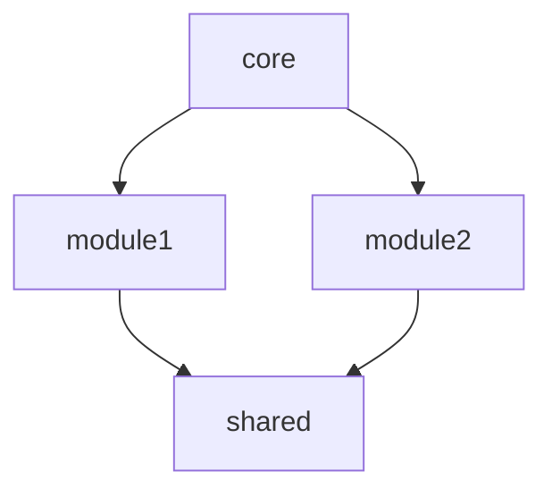

# SUI Architect - Reference Guide

Complete reference for templates, patterns, and advanced configurations.

## Template Library

### NFT Marketplace Template

**Modules:**
- `marketplace` - Core marketplace logic
- `nft` - NFT standard implementation
- `listing` - Listing management (fixed price)
- `auction` - Auction system
- `offer` - Offer/bid system
- `royalty` - Royalty distribution
- `utils` - Shared utilities

**Objects:**
```move
public struct Marketplace has key {
    id: UID,
    admin_cap: ID,
    platform_fee_bps: u64,  // Basis points (250 = 2.5%)
    fee_recipient: address,
    paused: bool,
    total_volume: u64
}

public struct Listing has key, store {
    id: UID,
    nft_id: ID,
    seller: address,
    price: u64,
    payment_token: TypeName,
    created_at: u64
}

public struct Auction has key, store {
    id: UID,
    nft_id: ID,
    seller: address,
    starting_price: u64,
    current_bid: u64,
    highest_bidder: Option<address>,
    end_time: u64,
    payment_token: TypeName
}
```

**Capabilities:**
- `MarketplaceAdminCap` - Platform administration
- `CreatorCap` - Collection creator privileges

**Recommended Tools:**
- `sui-kiosk` - NFT standard and trading
- `sui-walrus` - Metadata storage
- `sui-suins` - Name service

---

### DeFi AMM Template

**Modules:**
- `pool` - Liquidity pool management
- `swap` - Token swapping logic
- `liquidity` - LP token management
- `farm` - Liquidity mining
- `governance` - Protocol governance

**Objects:**
```move
public struct Pool has key {
    id: UID,
    token_a: TypeName,
    token_b: TypeName,
    reserve_a: u64,
    reserve_b: u64,
    lp_supply: u64,
    fee_bps: u64  // 30 = 0.3%
}

public struct LPToken has key, store {
    id: UID,
    pool_id: ID,
    amount: u64
}

public struct Position has key, store {
    id: UID,
    pool_id: ID,
    lp_tokens: u64,
    rewards_debt: u64
}
```

**Capabilities:**
- `AdminCap` - Protocol administration
- `EmergencyPauseCap` - Emergency controls

**Recommended Tools:**
- `sui-deepbook` - DEX integration

---

### GameFi Template

**Modules:**
- `game` - Core game state
- `character` - Character NFTs
- `inventory` - Item management
- `marketplace` - In-game trading
- `rewards` - Reward distribution

**Objects:**
```move
public struct Character has key, store {
    id: UID,
    name: String,
    level: u64,
    experience: u64,
    attributes: vector<Attribute>,
    equipment: vector<ID>  // Item IDs
}

public struct Item has key, store {
    id: UID,
    item_type: u8,
    rarity: u8,
    stats: vector<Stat>
}

public struct Inventory has key {
    id: UID,
    owner: address,
    items: vector<Item>,
    capacity: u64
}
```

**Capabilities:**
- `GameMasterCap` - Game administration
- `MinterCap` - Asset minting

**Recommended Tools:**
- `sui-walrus` - Asset storage
- `sui-kiosk` - Item trading
- `sui-zklogin` - Easy onboarding

---

### DAO Template

**Modules:**
- `governance` - DAO governance
- `proposal` - Proposal system
- `voting` - Voting mechanism
- `treasury` - Treasury management
- `timelock` - Time-delayed execution

**Objects:**
```move
public struct DAO has key {
    id: UID,
    name: String,
    treasury: Treasury,
    voting_period: u64,
    quorum_bps: u64,  // 2000 = 20%
    proposal_threshold: u64
}

public struct Proposal has key, store {
    id: UID,
    proposer: address,
    title: String,
    description: String,
    votes_for: u64,
    votes_against: u64,
    status: u8,  // 0=active, 1=passed, 2=rejected
    execution_time: u64
}

public struct Vote has store {
    voter: address,
    weight: u64,
    support: bool
}
```

**Capabilities:**
- `AdminCap` - Initial setup
- `ProposerCap` - Create proposals
- `ExecutorCap` - Execute passed proposals

**Recommended Tools:**
- `sui-multisig` - Multi-signature control

---

## Module Design Patterns

### 1. Capability-Based Access Control

```move
// Define capability
public struct AdminCap has key, store {
    id: UID
}

// Protect function with capability
public fun admin_only_function(
    _: &AdminCap,
    ctx: &mut TxContext
) {
    // Only callable with AdminCap
}

// Transfer capability
public fun transfer_admin(
    cap: AdminCap,
    recipient: address
) {
    transfer::transfer(cap, recipient);
}
```

### 2. Shared Object Pattern

```move
// Create shared object
public fun create_marketplace(ctx: &mut TxContext) {
    let marketplace = Marketplace {
        id: object::new(ctx),
        // ... fields
    };
    transfer::share_object(marketplace);
}

// Access shared object
public fun use_marketplace(
    marketplace: &mut Marketplace,
    ctx: &mut TxContext
) {
    // Multiple users can access
}
```

### 3. Dynamic Fields for Extensibility

```move
use sui::dynamic_field as df;

// Add dynamic field
public fun add_metadata(
    object: &mut SomeObject,
    key: String,
    value: String
) {
    df::add(&mut object.id, key, value);
}

// Read dynamic field
public fun get_metadata(
    object: &SomeObject,
    key: String
): &String {
    df::borrow(&object.id, key)
}
```

### 4. Event-Driven Architecture

```move
// Define events
public struct ListingCreated has copy, drop {
    listing_id: ID,
    seller: address,
    nft_id: ID,
    price: u64
}

public struct PurchaseCompleted has copy, drop {
    listing_id: ID,
    buyer: address,
    seller: address,
    price: u64
}

// Emit events
public fun create_listing(...) {
    // ... logic
    event::emit(ListingCreated {
        listing_id: object::id(&listing),
        seller: tx_context::sender(ctx),
        nft_id,
        price
    });
}
```

---

## Security Best Practices

### 1. Access Control

**Always use capabilities:**
```move
// ❌ Bad: Check address
public fun admin_function(ctx: &TxContext) {
    assert!(tx_context::sender(ctx) == @admin_address, ENotAdmin);
}

// ✅ Good: Use capability
public fun admin_function(_: &AdminCap, ctx: &TxContext) {
    // Capability proves authorization
}
```

### 2. Integer Safety

**Check for overflow/underflow:**
```move
// ❌ Bad: Unchecked arithmetic
let total = price + fee;

// ✅ Good: Checked arithmetic
let total = price.checked_add(fee).expect(EOverflow);
```

### 3. Reentrancy Protection

**SUI's object model provides built-in protection:**
- Objects are passed by value or mutable reference
- No external calls during critical sections
- Transaction atomicity guaranteed

### 4. Payment Verification

**Always verify payments:**
```move
public fun buy_item(
    payment: Coin<SUI>,
    expected_amount: u64
) {
    // Verify exact amount
    assert!(coin::value(&payment) == expected_amount, EInsufficientPayment);

    // Verify token type at compile time
    // (Generic type <SUI> enforces this)
}
```

### 5. Emergency Controls

**Implement pause mechanism:**
```move
public struct Marketplace has key {
    id: UID,
    paused: bool,
    // ... other fields
}

public fun pause(_: &AdminCap, marketplace: &mut Marketplace) {
    marketplace.paused = true;
}

public fun buy_item(marketplace: &Marketplace, ...) {
    assert!(!marketplace.paused, EMarketplacePaused);
    // ... rest of logic
}
```

---

## Security Threat Model Template

Include in every spec:

```markdown
## Security Considerations

### Threat Model

**Assets at Risk:**
- [List valuable assets in the system]

**Attack Vectors:**

1. **Reentrancy Attacks**
   - Risk: [Describe risk]
   - Mitigation: SUI's object model prevents reentrancy
   - Status: ✅ Protected by design

2. **Integer Overflow**
   - Risk: [Describe risk]
   - Mitigation: Use checked arithmetic
   - Status: ⚠️ Requires testing

3. **Front-running**
   - Risk: [Describe risk]
   - Mitigation: [Your mitigation strategy]
   - Status: [Status]

4. **Privilege Escalation**
   - Risk: Non-admin gains admin rights
   - Mitigation: Capability-based access control
   - Status: ✅ Protected by SUI capabilities

5. **Asset Theft**
   - Risk: Unauthorized asset transfer
   - Mitigation: [Your strategy]
   - Status: [Status]

### Security Checklist

Before deployment, verify:

- [ ] All admin functions protected by capability
- [ ] All numeric operations checked for overflow
- [ ] All payments verified (amount + token type)
- [ ] All asset transfers properly authorized
- [ ] Emergency pause mechanism tested
- [ ] No hardcoded addresses or keys
- [ ] All events emitted for tracking
- [ ] External audit completed (mainnet only)
```

---

## Specification Document Template

### Executive Summary

```markdown
## Executive Summary

[Project Name] is a [type] built on SUI blockchain, enabling users to [core functionality].

**Key Metrics:**
- Target Launch: [Date]
- Expected [Metric]: [Target]
- Team Size: [Number]

**Technology Stack:**
- SUI Framework: v[version]
- Key Tools: [List SUI tools]
- Frontend: [Framework]
```

### Architecture Diagram

```markdown
## Architecture Overview

```
┌─────────────────────────────────────────────┐
│           Frontend ([Framework])            │
└──────────────┬──────────────────────────────┘
               │
┌──────────────▼──────────────────────────────┐
│         SUI Move Smart Contracts            │
├─────────────────────────────────────────────┤
│  [module1] │ [module2] │ [module3]          │
└──────────────┬──────────────────────────────┘
               │
┌──────────────▼──────────────────────────────┐
│        SUI Ecosystem Integration            │
├─────────────────────────────────────────────┤
│  [tool1]   │  [tool2]  │  [tool3]           │
└─────────────────────────────────────────────┘
```
```

### Mermaid Dependency Diagram

```markdown
## Module Dependencies


```

---

## Advanced Configuration

### Custom Template Path

```json
{
  "templates": {
    "use_builtin": false,
    "custom_path": "~/.sui-architect/templates"
  }
}
```

Create custom templates in:
```
~/.sui-architect/templates/
├── my-template.json
└── my-template-spec.md
```

### Question Customization

```json
{
  "questions": {
    "skip_basic": false,
    "custom_questions": [
      {
        "phase": "requirements",
        "question": "Do you need multi-chain support?",
        "options": ["Yes", "No"]
      }
    ]
  }
}
```

### Documentation Generation

```json
{
  "docs": {
    "formats": ["markdown", "pdf"],
    "include_diagrams": true,
    "diagram_format": "mermaid",
    "include_code_samples": true
  }
}
```

---

## Integration Patterns

### With sui-docs-query

```typescript
// Query Kiosk documentation
const kioskDocs = await sui_docs_query({
  type: "docs",
  target: "kiosk",
  query: "transfer policy best practices"
});

// Include in spec
spec.integrations.kiosk = {
  documentation: kioskDocs,
  version: kioskDocs.version
};
```

### With sui-developer

```typescript
// After spec generation, pass to developer
await sui_developer({
  spec_file: "docs/specs/2024-01-28-project-spec.md",
  mode: "generate_from_spec",
  quality_mode: "strict"
});
```

---

## Gas Optimization Patterns

### 1. Use Vectors Wisely

```move
// ❌ Bad: Large vector in shared object
public struct BadDesign has key {
    id: UID,
    all_users: vector<address>  // Expensive to modify
}

// ✅ Good: Use dynamic fields
public struct GoodDesign has key {
    id: UID,
    user_count: u64
}
// Store individual users as dynamic fields
```

### 2. Batch Operations

```move
// ❌ Bad: Multiple transactions
for item in items {
    process_item(item);  // Each is a transaction
}

// ✅ Good: Single transaction
public fun process_batch(items: vector<Item>) {
    // Process all in one transaction
}
```

### 3. Minimize Storage

```move
// ❌ Bad: Store redundant data
public struct Listing has key {
    id: UID,
    nft_id: ID,
    nft_name: String,      // Redundant
    nft_description: String  // Redundant
}

// ✅ Good: Reference by ID only
public struct Listing has key {
    id: UID,
    nft_id: ID  // Query NFT object for details
}
```

---

This reference guide provides complete details for all templates, patterns, and best practices used by sui-architect.
